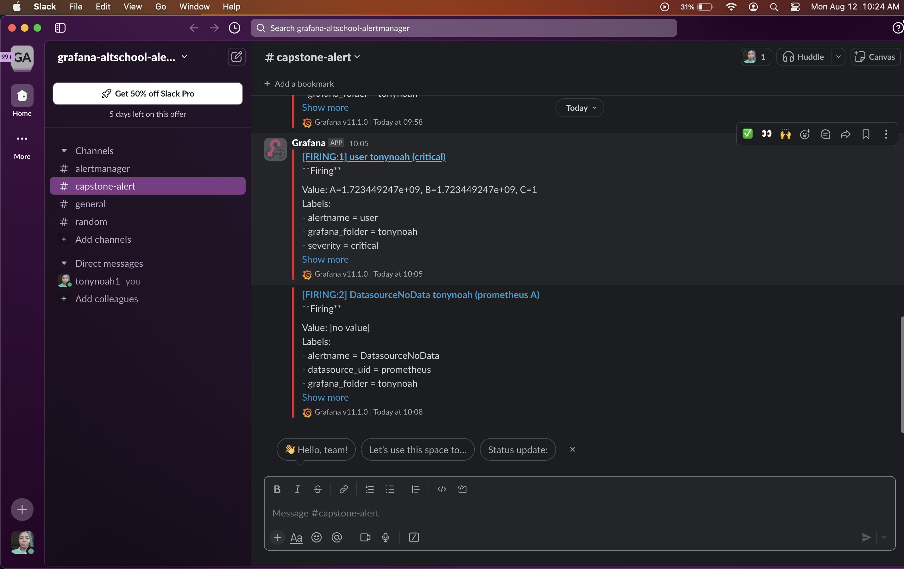

# Deploy the Sock-shop Microservice on kubernetes cluster

## EXPECTATIONS

1. Deploy pipeline
2. Metrics (Alertmanager)
3. Monitoring (Grafana)
4. Logging (Prometheus)
5. Use Prometheus as a monitoring tool
6. Use Ansible or Terraform as the configuration management tool.
7. You can use an IaaS provider of your choice.
8. The application should run on Kubernetes
9. The application should run on HTTPS with a Let’s Encrypt certificate.

## Requirements:
* active subscription with Azure
* install vscode
* install azure cli, kubectl, helm(package manager for kubernetes),     and terraform

## now the steps taken to achieve the above
1. ` first thing is to initialize terraform in your root directory, then do terraform plan and terraform apply to set up your kubernetes cluster on your cloud provider`

2. `after we have created our cluster, we need to update our kubeconfig, else we wont be able to communicate with the cluster`

3. `we would now try to deploy our application using the deployment yaml file that we got from the github link that was supplied for this project, once it is deployed successfully, you will see it like the image below`

4. `you can confirm if your application is up and running using "kubectl get pods,svc -n sock-shop" , this command will list all the available pods and services in the sock-shop namespace`

5. `Now we need to install the ingress controller, the ingress controller helps to route traffic to our pod and in this case we will like to access our application using the ingress external ip, now to do this, we will be using the helm package to add the nginx-ingress repo to your local development area. so, we would use these commands "helm repo add nginx https://helm.nginx.com/stable" then after it has been added successfully, we will now do "helm repo update" this helps to update the repositories that well just added, next step is to do "helm search repo nginx" this helps us to search the repo, so we can get the exact nginx chart we will be installing. Once we see the exact one we want, then we can now install using "helm install ingress nginx/nginx-ingress". you can now check the installation using "kubectl get pods,svc" this helps to check all pods and services running in the default namespace`

6. `the next step is to go to our name cheap dashboard and create an "A record" to map our ingress external ip address to our domain name, then we will also create "CNAME" records that will serve the different pods that we will like to access using our browser`

7. `let us now apply our ingress rule so that we can able to access our application using our domain name on the browser, we would be using this command "kubectl apply -f main-ingress.yaml" or you can use "helm install my-app/templates/main-ingress.yaml" either of this will apply our ingress configuration for us`

8. `Now let us try to access our application on our brower, as you can see from the browser that it is rendering the sock-shop app, but it is showing Not Secured`

9. `the next step now is to apply for our let's encrypt certificate, and for us to be able to do that we must first install the "cert-manager", we would be using helm to add the jetstack repo, then we can now install the cert-manager and all its dependencies. we would be using these links "helm repo add jetstack https://charts.jetstack.io --force-update" and "kubectl apply -f https://github.com/cert-manager/cert-manager/releases/download/v1.15.2/cert-manager.yaml". After we apply this , all the dependencies would be installed as you can see below.`

10. `Now that our cert-manager and all its dependencies has been added and installed, we would now create an issuer or clusterissuer configuration and also a certificate yaml file, you can get how to create all these from the official documentation of cert-manager. So, after you have created those two files, you will now apply them in this format, first you must make sure your main-ingress has been annotated correctly, with your TLS. You will apply your ingress first, followed by the issuer, then the certificate request comes last. Once, you have done that, you can check the status of your certificate using "kubectl get certificate -n sock-shop". Once it is succesful, you will see the status as true as you can see below`

11. `our next step now is to test our page to see if it has been encrpyted successfully, as you can see from below, our site is now secured`

12. `now let us try to deploy our monitoring and logging too, we would be using helm to add the repo "helm repo add prometheus-community https://prometheus-community.github.io/helm-charts" after this, we would now search the repo using "helm search repo prometheus", then we would install this particular chart using "helm install prome prometheus-community/kube-prometheus-stack -n sock-shop", once it is installed successfully, you can do "kubectl get pods,svc -n sock-shop". we are searching the sock-shop namespace because we deployed it in the sock-shop namespace`

13. `now for us to access the grafana and prometheus dashboard using our browser, we would need to update our main-ingress.yaml file`

14. `once we have successfully, updated our ingress yaml file with the correct service name and ports that both grafana and prometheus is running, the next step is to get the default username and password for the grafana dashboard, and we will be using two different commands to do that. First, is to get the grafana pod name using "kubectl get pods -n sock-shop", once we get the name, we would now use another commmand called "kubectl describe pod <grafana pod name> -n sock-shop" once it is up and running, look for the environment variable section, you will find the secret name that stores both the password and the username. Once, you see the secret name, next is to decode the details using this command "kubectl get secret prometheus-grafana -n <namespace> -o jsonpath="{.data.admin-user}" | base64 --decode
kubectl get secret prometheus-grafana -n <namespace> -o jsonpath="{.data.admin-password}" | base64 --decode`

15. `the next step is to copy the username and the pasword and login to your grafana dashboard`

`for prometheus, you dont need a password and username, so launch it on your browser and it will show like below`

16. `also, for our alert manager, you can configure it to send you a notification whenever something goes wrong. so lets imagine we want to use Slack notification, you can set an alert rule on your grafana dashboard to do that. But you must first create a workspace on slack or you must be an admin of a slack workspace, then you will need to install a webhook on the slack workspace, that way you will be provided with your slack webhook api, the webhook api would be needed for the alerting rule when you are setting it  up on the grafana dashboard, so after succesfully setting it up, you can trigger it either by deleting a pod or anything and you will get a notification on your dedicated channel for the alert on your slack workspace`
